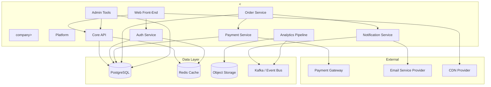

# Critical Business Processes

## Process Inventory

The table below lists \<company\>'s business-critical processes ranked by impact severity.

| # | Process | Owner | Tier | Max Tolerable Downtime |
|---|---------|-------|------|------------------------|
| 1 | User authentication & session management | Platform Team | P0 | 5 min |
| 2 | Payment processing & billing | Payments Team | P0 | 5 min |
| 3 | Core API (product catalogue, search) | Backend Team | P0 | 15 min |
| 4 | Order management & fulfilment | Commerce Team | P1 | 30 min |
| 5 | Customer notifications (email, push) | Growth Team | P1 | 1 h |
| 6 | Analytics & event pipeline | Data Team | P2 | 4 h |
| 7 | Internal admin & back-office tools | Platform Team | P2 | 4 h |
| 8 | Marketing site & CMS | Marketing Team | P3 | 24 h |

### Tier Definitions

- **P0 — Mission Critical**: Immediate revenue or trust impact. Requires automated failover.
- **P1 — Business Critical**: Significant user-facing degradation within minutes. Requires hot standby.
- **P2 — Important**: Internal or delayed-impact processes. Warm recovery acceptable.
- **P3 — Supporting**: Low urgency. Cold recovery acceptable.

## Dependency Map

## Single Points of Failure

| Component | Risk | Mitigation |
|-----------|------|------------|
| PostgreSQL primary | Total write-path failure | Multi-AZ replicas, automated failover |
| Redis cluster | Auth token and cache loss | Sentinel / cluster mode, fallback to DB |
| Payment gateway | Revenue halt | Secondary gateway, circuit breaker |
| Kafka broker quorum | Event loss, pipeline stall | Multi-broker cluster, replication factor ≥ 3 |
| DNS provider | Complete reachability loss | Secondary DNS, low TTL |
