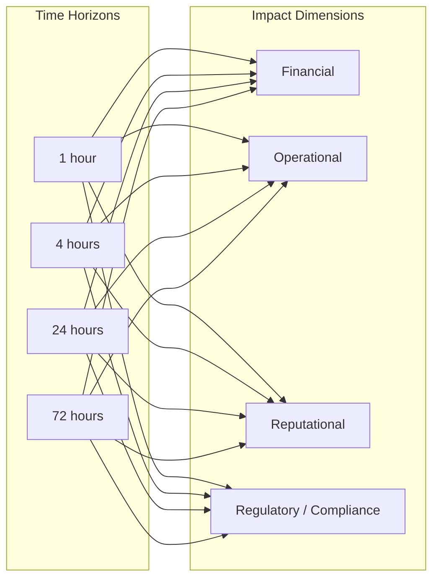

# Impact Assessment

## Impact Categories

Every critical process is assessed across four impact dimensions at escalating downtime intervals.

## Scoring Matrix

Impact is scored on a 1–5 scale:

| Score | Severity | Description |
|-------|----------|-------------|
| 1 | Negligible | No noticeable effect on users or revenue |
| 2 | Minor | Small subset of users affected; workaround available |
| 3 | Moderate | Significant user segment affected; partial revenue loss |
| 4 | Major | Majority of users affected; material revenue loss |
| 5 | Catastrophic | Complete service outage; existential business risk |

## Impact Assessment by Process

### Authentication & Session Management

| Dimension | 1 h | 4 h | 24 h | 72 h |
|-----------|-----|-----|------|------|
| Financial | 4 | 5 | 5 | 5 |
| Operational | 5 | 5 | 5 | 5 |
| Reputational | 3 | 4 | 5 | 5 |
| Regulatory | 2 | 3 | 4 | 5 |

### Payment Processing

| Dimension | 1 h | 4 h | 24 h | 72 h |
|-----------|-----|-----|------|------|
| Financial | 5 | 5 | 5 | 5 |
| Operational | 4 | 5 | 5 | 5 |
| Reputational | 3 | 4 | 5 | 5 |
| Regulatory | 3 | 4 | 5 | 5 |

### Core API

| Dimension | 1 h | 4 h | 24 h | 72 h |
|-----------|-----|-----|------|------|
| Financial | 3 | 4 | 5 | 5 |
| Operational | 4 | 5 | 5 | 5 |
| Reputational | 3 | 4 | 5 | 5 |
| Regulatory | 1 | 2 | 3 | 4 |

### Order Management

| Dimension | 1 h | 4 h | 24 h | 72 h |
|-----------|-----|-----|------|------|
| Financial | 3 | 4 | 5 | 5 |
| Operational | 3 | 4 | 5 | 5 |
| Reputational | 2 | 3 | 4 | 5 |
| Regulatory | 1 | 2 | 3 | 4 |

### Analytics Pipeline

| Dimension | 1 h | 4 h | 24 h | 72 h |
|-----------|-----|-----|------|------|
| Financial | 1 | 1 | 2 | 3 |
| Operational | 2 | 2 | 3 | 4 |
| Reputational | 1 | 1 | 1 | 2 |
| Regulatory | 1 | 2 | 3 | 4 |

## Aggregate Impact Heat Map

| Process | 1 h | 4 h | 24 h | 72 h |
|---------|-----|-----|------|------|
| **Auth** | 4.0 🟠 | 4.5 🔴 | 5.0 🔴 | 5.0 🔴 |
| **Payments** | 4.0 🟠 | 4.5 🔴 | 5.0 🔴 | 5.0 🔴 |
| **Core API** | 3.0 🟡 | 4.0 🟠 | 4.5 🔴 | 4.5 🔴 |
| **Orders** | 2.5 🟡 | 3.5 🟠 | 4.5 🔴 | 5.0 🔴 |
| **Analytics** | 1.5 🟢 | 1.5 🟢 | 2.5 🟡 | 3.5 🟠 |

> Scores represent the average across all four impact dimensions. Colour key: 🟢 ≤ 2 | 🟡 2–3 | 🟠 3–4 | 🔴 ≥ 4

## Financial Impact Estimates

| Process | Estimated Revenue Loss / Hour | Estimated Cost to Recover |
|---------|-------------------------------|---------------------------|
| Authentication | £50,000 | £5,000 |
| Payment Processing | £80,000 | £10,000 |
| Core API | £40,000 | £3,000 |
| Order Management | £30,000 | £4,000 |
| Analytics Pipeline | £2,000 | £1,000 |

> Figures are illustrative and should be calibrated with Finance during annual review.
