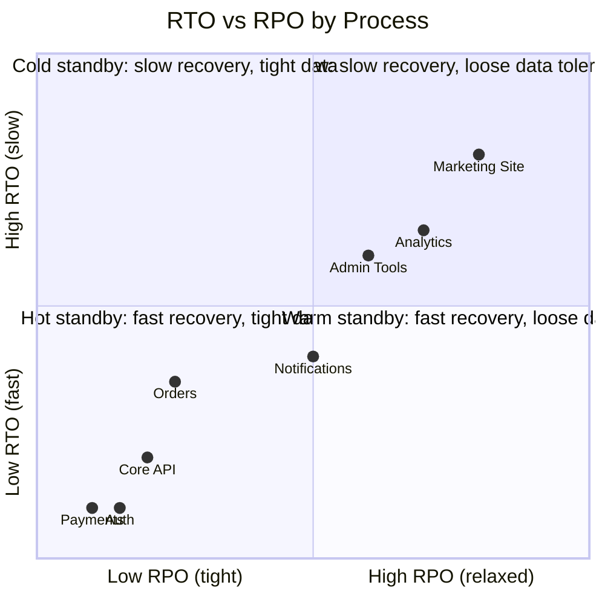
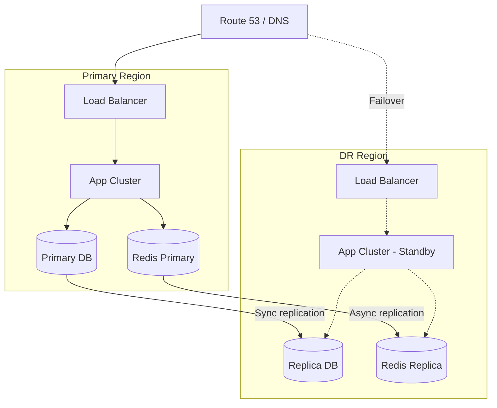

# Recovery Objectives

## RTO and RPO Summary

## Recovery Objectives Table

| Process | RTO | RPO | Recovery Strategy |
|---------|-----|-----|-------------------|
| Authentication | 5 min | 0 (synchronous replication) | Active-active multi-region |
| Payment Processing | 5 min | 0 | Active-passive with automated failover |
| Core API | 15 min | 1 min | Multi-AZ auto-scaling group, blue-green |
| Order Management | 30 min | 5 min | Warm standby, async replication |
| Notifications | 1 h | 15 min | Queue-backed, replay from event log |
| Analytics Pipeline | 4 h | 1 h | Cold restart, backfill from object storage |
| Admin Tools | 4 h | 1 h | Redeployment from CI/CD |
| Marketing Site | 24 h | 24 h | Static rebuild from CMS |

## Recovery Architecture

## Recovery Procedures

### Automated Failover (P0 Services)

1. Health-check failure detected by load balancer (3 consecutive failures, 10 s interval).
2. DNS failover triggered automatically (TTL 60 s).
3. Standby region promoted to primary.
4. On-call paged via PagerDuty with runbook link.
5. Post-failover validation: synthetic transaction suite executes within 2 min.

### Manual Failover (P1–P2 Services)

1. On-call engineer assesses incident severity.
2. Decision to failover made within 15 min of detection.
3. Runbook executed: promote replica, redirect traffic, verify data integrity.
4. Stakeholders notified via status page and Slack.

## Recovery Testing

| Test Type | Frequency | Scope | Owner |
|-----------|-----------|-------|-------|
| Automated failover drill | Monthly | P0 services | SRE |
| Tabletop exercise | Quarterly | All tiers | CTO + leads |
| Full DR simulation | Annually | Entire platform | All engineering |
| Backup restore test | Monthly | All databases | DBA / Platform |

## Continuity Gaps and Recommendations

| Gap | Risk | Recommendation | Priority |
|-----|------|----------------|----------|
| No secondary payment gateway | Single vendor failure halts revenue | Integrate backup gateway with circuit breaker | High |
| Analytics pipeline has no replay | Data loss on Kafka failure | Implement S3-backed event archive | Medium |
| Admin tools share primary DB | DR promotion blocks admin access | Read-replica routing for admin queries | Low |
| No regular chaos engineering | Untested failure modes | Adopt Chaos Monkey / Litmus for monthly experiments | Medium |
