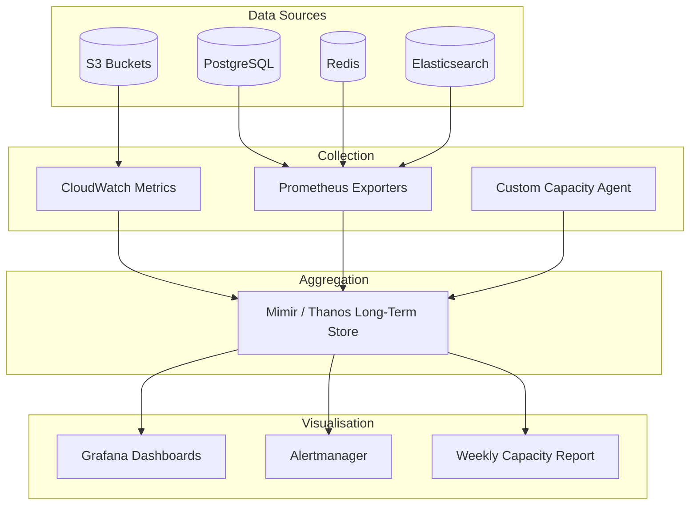
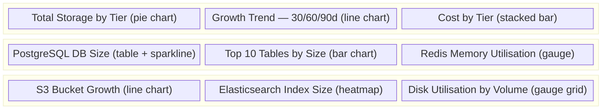
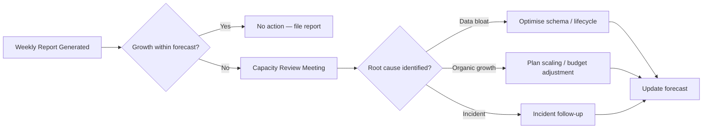

# Capacity Visibility

## Objective

Provide real-time and trend-based visibility into storage consumption across all tiers so that engineering and finance teams can forecast growth, control costs, and prevent capacity-related outages.

## Visibility Architecture

## Key Visibility Metrics

| Metric | Source | Granularity | Retention |
|--------|--------|-------------|-----------|
| `pg_database_size_bytes` | postgres_exporter | Per database, 60 s | 13 months |
| `pg_table_size_bytes` | postgres_exporter | Per table, 5 min | 13 months |
| `redis_used_memory_bytes` | redis_exporter | Per instance, 30 s | 6 months |
| `s3_bucket_size_bytes` | CloudWatch | Per bucket, daily | 24 months |
| `s3_number_of_objects` | CloudWatch | Per bucket, daily | 24 months |
| `es_index_store_size_bytes` | elasticsearch_exporter | Per index, 60 s | 6 months |
| `disk_used_percent` | node_exporter | Per volume, 30 s | 6 months |

## Dashboard Layout

## Alerting Rules

| Alert | Condition | Severity | Action |
|-------|-----------|----------|--------|
| DiskSpaceCritical | `disk_used_percent > 90` for 5 min | P1 | Page on-call, expand volume |
| DiskSpaceWarning | `disk_used_percent > 80` for 15 min | P2 | Ticket for capacity review |
| PostgreSQLGrowthAnomaly | Growth rate > 2× 30-day average | P2 | Investigate unexpected writes |
| RedisMemoryHigh | `redis_used_memory / redis_maxmemory > 0.85` | P1 | Review eviction policy, scale |
| S3BucketCostSpike | Daily cost > 1.5× 7-day average | P3 | Review lifecycle policies |

## Weekly Capacity Report

Automatically generated every Monday and posted to `#platform-capacity` Slack channel.

**Contents:**

1. Total storage footprint by tier (current vs. previous week).
2. Month-over-month growth rate per data store.
3. Projected capacity exhaustion date (if trending toward limits).
4. Top 5 fastest-growing tables / buckets / indices.
5. Cost delta vs. budget.

## Capacity Review Process

