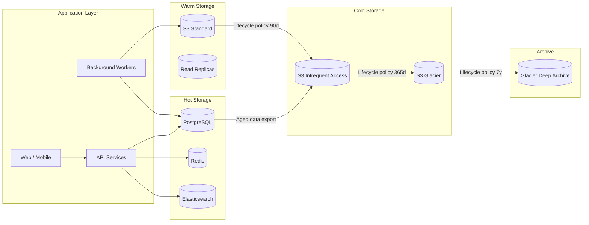

# Storage Tiering & Capacity Visibility — Overview

## Purpose

Define a clear storage tiering strategy for \<company\> that balances performance, cost, and compliance. Pair it with capacity visibility tooling so that growth is predictable and cost-efficient.

## Guiding Principles

1. **Data has a lifecycle** — Access patterns change over time; storage tiers should follow.
2. **Visibility before optimisation** — You cannot manage what you cannot see.
3. **Automate transitions** — Manual data movement is error-prone and expensive.
4. **Cost-aware engineering** — Storage decisions should be justified by $/GB/month and access-frequency data.

## Storage Landscape at \<company\>

## Key Metrics

| Metric | Purpose |
|--------|---------|
| Total provisioned storage (GB) | Capacity planning |
| Storage utilisation (%) | Headroom monitoring |
| Cost per GB per tier ($/GB/month) | Cost optimisation |
| Data growth rate (GB/month) | Forecasting |
| Object count and average size | Lifecycle policy tuning |
| Access frequency per tier | Tier placement validation |
