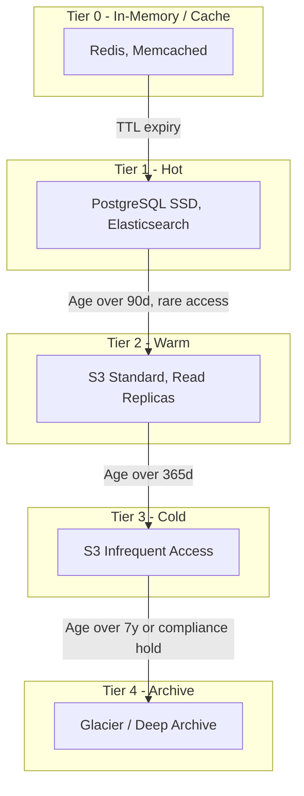
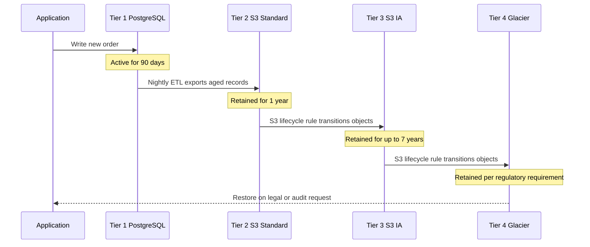

# Storage Tiering Model

## Tier Definitions



## Tier Detail

### Tier 0 — In-Memory / Cache

| Attribute | Value |
|-----------|-------|
| Technology | Redis Cluster, application-level cache |
| Latency target | < 1 ms |
| Typical data | Session tokens, feature flags, hot query cache |
| Retention | TTL-based (seconds to hours) |
| Cost profile | Highest $/GB — optimise for smallest working set |

### Tier 1 — Hot

| Attribute | Value |
|-----------|-------|
| Technology | PostgreSQL (gp3 SSD), Elasticsearch |
| Latency target | < 10 ms |
| Typical data | Active users, orders, product catalogue, search index |
| Retention | Until aged out by lifecycle policy (default 90 days for transactional) |
| Cost profile | High $/GB — keep only actively queried data |

### Tier 2 — Warm

| Attribute | Value |
|-----------|-------|
| Technology | S3 Standard, PostgreSQL read replicas |
| Latency target | < 100 ms (API), seconds (batch) |
| Typical data | Historical reports, exported datasets, media assets |
| Retention | 90–365 days |
| Cost profile | Moderate $/GB — good for infrequent reads |

### Tier 3 — Cold

| Attribute | Value |
|-----------|-------|
| Technology | S3 Infrequent Access |
| Latency target | Seconds |
| Typical data | Archived orders, old logs, audit trails |
| Retention | 1–7 years |
| Cost profile | Low $/GB — retrieval fees apply |

### Tier 4 — Archive

| Attribute | Value |
|-----------|-------|
| Technology | S3 Glacier, Glacier Deep Archive |
| Latency target | Minutes to hours |
| Typical data | Regulatory retention, legal holds, historical backups |
| Retention | 7+ years |
| Cost profile | Lowest $/GB — high retrieval latency and cost |

## Data Lifecycle Flow



## Lifecycle Policy Configuration (Example)

```json
{
  "Rules": [
    {
      "ID": "warm-to-cold",
      "Status": "Enabled",
      "Filter": { "Prefix": "exports/" },
      "Transitions": [
        { "Days": 365, "StorageClass": "STANDARD_IA" }
      ]
    },
    {
      "ID": "cold-to-archive",
      "Status": "Enabled",
      "Filter": { "Prefix": "exports/" },
      "Transitions": [
        { "Days": 2555, "StorageClass": "DEEP_ARCHIVE" }
      ]
    }
  ]
}
```

## Cost Comparison

| Tier | Approximate $/GB/month | Access Pattern |
|------|------------------------|----------------|
| Tier 0 (Redis) | £0.15 – £0.30 | Real-time, sub-ms |
| Tier 1 (PostgreSQL SSD) | £0.10 – £0.20 | Transactional, < 10 ms |
| Tier 2 (S3 Standard) | £0.023 | Periodic batch reads |
| Tier 3 (S3 IA) | £0.0125 | Rare reads (< 1/month) |
| Tier 4 (Glacier DA) | £0.00099 | Compliance / legal only |

> Prices are illustrative (AWS eu-west-2). Validate against current pricing.
