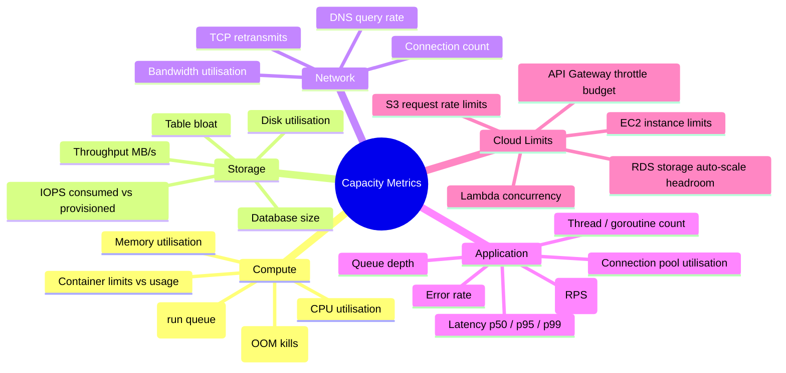

# Defining Capacity Metrics

## Principles

1. **Measure what matters** — Focus on metrics that directly correlate with user-facing performance or cost.
2. **USE method** — For every resource, track **Utilisation**, **Saturation**, and **Errors**.
3. **RED method** — For every service, track **Rate**, **Errors**, and **Duration**.
4. **Layer coverage** — Metrics must span compute, storage, network, and application layers.

## Metric Taxonomy

## Compute Metrics

| Metric | PromQL / Source | Target | Why It Matters |
|--------|-----------------|--------|----------------|
| CPU utilisation | `rate(node_cpu_seconds_total{mode!="idle"}[5m])` | < 70% sustained | Headroom for traffic spikes |
| CPU saturation | `node_load1 / count(node_cpu_seconds_total{mode="idle"})` | < 1.0 | Indicates queuing |
| Memory utilisation | `1 - (node_memory_MemAvailable_bytes / node_memory_MemTotal_bytes)` | < 80% | OOM prevention |
| Container CPU throttle | `rate(container_cpu_cfs_throttled_seconds_total[5m])` | < 5% of period | Detects under-provisioned limits |
| Container memory working set | `container_memory_working_set_bytes / container_spec_memory_limit_bytes` | < 85% | OOM kill prevention |

## Storage Metrics

| Metric | Source | Target | Why It Matters |
|--------|--------|--------|----------------|
| Disk used % | `node_filesystem_avail_bytes` | < 80% | Prevents write failures |
| PostgreSQL DB size | `pg_database_size_bytes` | Track trend | Forecasting |
| Table bloat ratio | Custom query | < 20% | Performance and vacuum tuning |
| IOPS consumed | CloudWatch `VolumeReadOps + VolumeWriteOps` | < 80% of provisioned | I/O bottleneck prevention |
| S3 request rate | CloudWatch | Track trend | Throttling prevention |

## Network Metrics

| Metric | Source | Target | Why It Matters |
|--------|--------|--------|----------------|
| Bandwidth in/out | `node_network_receive_bytes_total` | < 70% of NIC capacity | Congestion prevention |
| Active connections | `node_netstat_Tcp_CurrEstab` | Track trend | Connection exhaustion |
| TCP retransmits | `node_netstat_Tcp_RetransSegs` | Low / stable | Network quality indicator |

## Application Metrics

| Metric | Source | Target | Why It Matters |
|--------|--------|--------|----------------|
| Request rate | `rate(http_requests_total[5m])` | Track trend | Demand signal |
| Latency p99 | `histogram_quantile(0.99, rate(http_request_duration_seconds_bucket[5m]))` | < SLO | User experience |
| Error rate | `rate(http_requests_total{status=~"5.."}[5m])` | < 0.1% | Reliability |
| Queue depth | `queue_messages_ready` | < 10,000 | Back-pressure signal |
| DB connection pool usage | `pool_active / pool_max` | < 80% | Connection exhaustion |

## Cloud Service Limits

| Limit | How to Monitor | Action When Close |
|-------|----------------|-------------------|
| EC2 vCPU quota | AWS Service Quotas API | Request increase, architectural review |
| RDS max storage | `rds_free_storage_space` | Enable auto-scaling or archive data |
| ELB active connections | CloudWatch `ActiveConnectionCount` | Scale target group, review keep-alive |
| Lambda concurrent executions | CloudWatch `ConcurrentExecutions` | Request increase, add reserved concurrency |
| API Gateway requests/s | CloudWatch `Count` | Request throttle increase or add caching |
