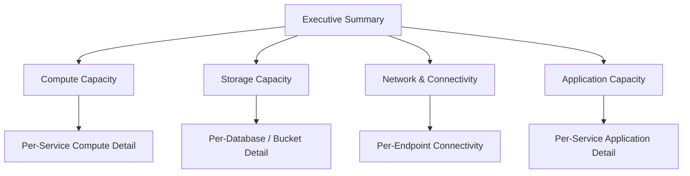
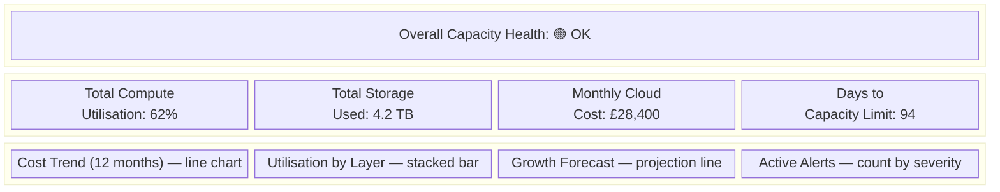
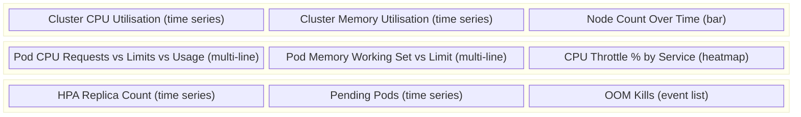
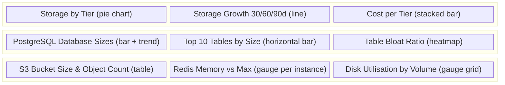
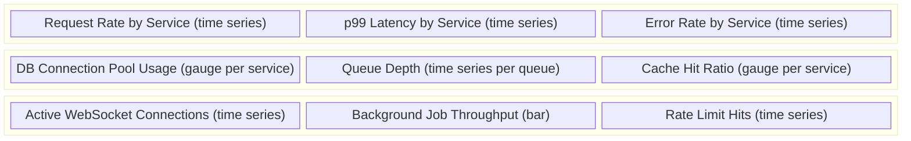
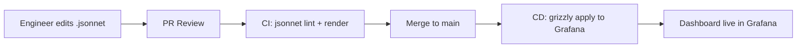

# Capacity Dashboards

## Dashboard Hierarchy



| Level | Audience | Refresh Rate | Retention |
|-------|----------|--------------|-----------|
| L0 — Executive Summary | VP Eng, CTO, Finance | 5 min | 24 months |
| L1 — Domain Overviews | Team leads, SRE | 1 min | 13 months |
| L2 — Service Detail | Service owners, on-call | 30 s | 6 months |

## L0 — Executive Summary Dashboard

**Purpose:** Single-pane view of platform capacity health for leadership.

### Layout



### Key Panels

| Panel | Metric | Visualisation |
|-------|--------|---------------|
| Capacity Health | Worst-case utilisation across all layers | Stat (colour-coded) |
| Compute Utilisation | Avg CPU across all services | Gauge |
| Storage Used | Sum of all tier sizes | Stat + trend sparkline |
| Monthly Cost | AWS Cost Explorer data | Time series |
| Days to Limit | Linear projection to nearest hard limit | Stat |
| Active Alerts | Count of firing capacity alerts | Stat by severity |

## L1 — Compute Capacity Dashboard

### Layout



## L1 — Storage Capacity Dashboard

### Layout



## L1 — Application Capacity Dashboard

### Layout



## Dashboard-as-Code

All dashboards are version-controlled as Grafana JSON models or Grafonnet (Jsonnet) and deployed via CI/CD.

```
dashboards/
├── L0-executive-summary.jsonnet
├── L1-compute.jsonnet
├── L1-storage.jsonnet
├── L1-network.jsonnet
├── L1-application.jsonnet
└── L2/
    ├── auth-service.jsonnet
    ├── payment-service.jsonnet
    └── ...
```

### Deployment Pipeline



## Dashboard Standards

1. **Consistent time ranges** — Default to "Last 6 hours" with quick selectors for 1h, 24h, 7d, 30d.
2. **Annotations** — Overlay deployments, incidents, and scaling events.
3. **Variables** — Use Grafana template variables for cluster, namespace, service.
4. **Thresholds** — Colour panels green / amber / red aligned with alert thresholds.
5. **Links** — Every panel links to the relevant L2 drill-down dashboard.
6. **Documentation** — Each dashboard includes a description panel explaining purpose and ownership.
