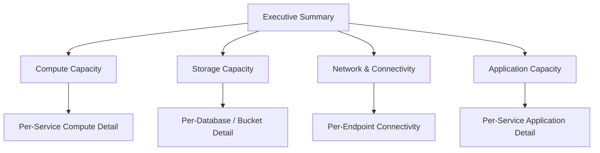
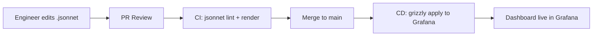

# Capacity Dashboards

## Dashboard Hierarchy



| Level | Audience | Refresh Rate | Retention |
|-------|----------|--------------|-----------|
| L0 — Executive Summary | VP Eng, CTO, Finance | 5 min | 24 months |
| L1 — Domain Overviews | Team leads, SRE | 1 min | 13 months |
| L2 — Service Detail | Service owners, on-call | 30 s | 6 months |

## L0 — Executive Summary Dashboard

**Purpose:** Single-pane view of platform capacity health for leadership.

### Layout

| | Col 1 | Col 2 | Col 3 | Col 4 |
|---|---|---|---|---|
| **Header** | Overall Capacity Health: 🟢 OK | | | |
| **KPIs** | Total Compute Utilisation: 62% | Total Storage Used: 4.2 TB | Monthly Cloud Cost: £28,400 | Days to Capacity Limit: 94 |
| **Charts** | Cost Trend (12 months) — line | Utilisation by Layer — stacked bar | Growth Forecast — projection line | Active Alerts — count by severity |

### Key Panels

| Panel | Metric | Visualisation |
|-------|--------|---------------|
| Capacity Health | Worst-case utilisation across all layers | Stat (colour-coded) |
| Compute Utilisation | Avg CPU across all services | Gauge |
| Storage Used | Sum of all tier sizes | Stat + trend sparkline |
| Monthly Cost | AWS Cost Explorer data | Time series |
| Days to Limit | Linear projection to nearest hard limit | Stat |
| Active Alerts | Count of firing capacity alerts | Stat by severity |

## L1 — Compute Capacity Dashboard

### Layout

| Row | Panel 1 | Panel 2 | Panel 3 |
|-----|---------|---------|---------|
| **Cluster** | Cluster CPU Utilisation (time series) | Cluster Memory Utilisation (time series) | Node Count Over Time (bar) |
| **Pods** | Pod CPU Requests vs Limits vs Usage (multi-line) | Pod Memory Working Set vs Limit (multi-line) | CPU Throttle % by Service (heatmap) |
| **Scaling** | HPA Replica Count (time series) | Pending Pods (time series) | OOM Kills (event list) |

## L1 — Storage Capacity Dashboard

### Layout

| Row | Panel 1 | Panel 2 | Panel 3 |
|-----|---------|---------|---------|
| **Overview** | Storage by Tier (pie chart) | Storage Growth 30/60/90d (line) | Cost per Tier (stacked bar) |
| **Databases** | PostgreSQL Database Sizes (bar + trend) | Top 10 Tables by Size (horizontal bar) | Table Bloat Ratio (heatmap) |
| **Infrastructure** | S3 Bucket Size & Object Count (table) | Redis Memory vs Max (gauge per instance) | Disk Utilisation by Volume (gauge grid) |

## L1 — Application Capacity Dashboard

### Layout

| Row | Panel 1 | Panel 2 | Panel 3 |
|-----|---------|---------|---------|
| **Traffic** | Request Rate by Service (time series) | p99 Latency by Service (time series) | Error Rate by Service (time series) |
| **Resources** | DB Connection Pool Usage (gauge per service) | Queue Depth (time series per queue) | Cache Hit Ratio (gauge per service) |
| **Connections** | Active WebSocket Connections (time series) | Background Job Throughput (bar) | Rate Limit Hits (time series) |

## Dashboard-as-Code

All dashboards are version-controlled as Grafana JSON models or Grafonnet (Jsonnet) and deployed via CI/CD.

```
dashboards/
├── L0-executive-summary.jsonnet
├── L1-compute.jsonnet
├── L1-storage.jsonnet
├── L1-network.jsonnet
├── L1-application.jsonnet
└── L2/
    ├── auth-service.jsonnet
    ├── payment-service.jsonnet
    └── ...
```

### Deployment Pipeline



## Dashboard Standards

1. **Consistent time ranges** — Default to "Last 6 hours" with quick selectors for 1h, 24h, 7d, 30d.
2. **Annotations** — Overlay deployments, incidents, and scaling events.
3. **Variables** — Use Grafana template variables for cluster, namespace, service.
4. **Thresholds** — Colour panels green / amber / red aligned with alert thresholds.
5. **Links** — Every panel links to the relevant L2 drill-down dashboard.
6. **Documentation** — Each dashboard includes a description panel explaining purpose and ownership.
