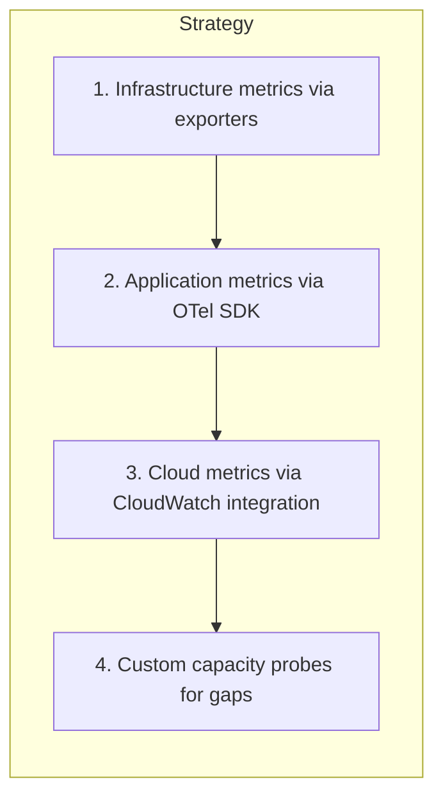
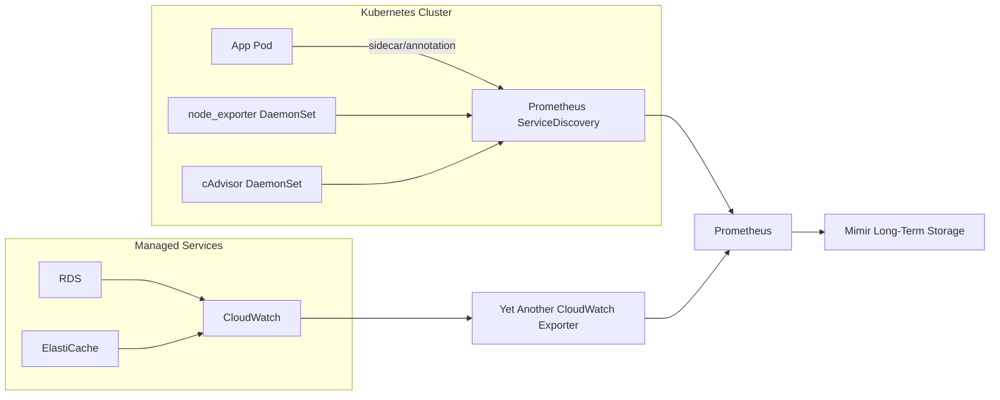
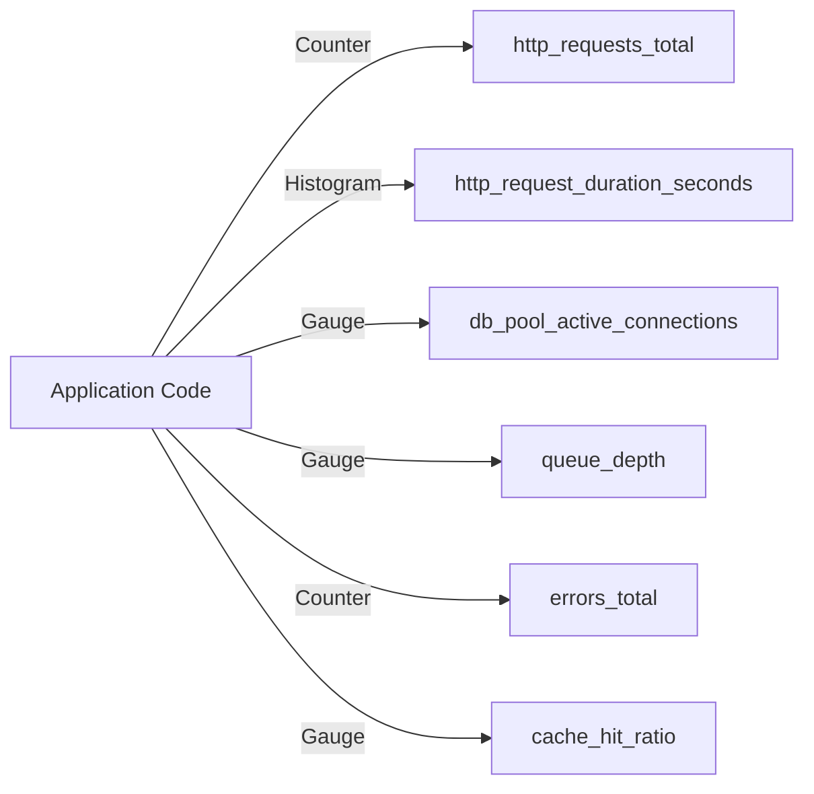

# Instrumenting Systems for Capacity Visibility

## Instrumentation Strategy



## Infrastructure Instrumentation

### Prometheus Exporters

| Exporter | Targets | Key Metrics |
|----------|---------|-------------|
| `node_exporter` | All EC2 / VM hosts | CPU, memory, disk, network |
| `postgres_exporter` | PostgreSQL instances | DB size, connections, replication lag |
| `redis_exporter` | Redis instances | Memory, connected clients, evictions |
| `elasticsearch_exporter` | Elasticsearch clusters | Index size, JVM heap, query latency |
| `blackbox_exporter` | External endpoints | Probe success, latency |
| `cadvisor` | Kubernetes nodes | Container CPU, memory, I/O |

### Deployment Pattern



## Application Instrumentation

### OpenTelemetry Setup

Applications emit metrics using the OpenTelemetry SDK. The collector normalises, batches, and forwards to Prometheus/Mimir.

```yaml
# otel-collector-config.yaml (simplified)
receivers:
  otlp:
    protocols:
      grpc:
        endpoint: 0.0.0.0:4317
      http:
        endpoint: 0.0.0.0:4318

processors:
  batch:
    timeout: 5s
    send_batch_size: 1024
  memory_limiter:
    limit_mib: 512

exporters:
  prometheusremotewrite:
    endpoint: "http://mimir:9009/api/v1/push"

service:
  pipelines:
    metrics:
      receivers: [otlp]
      processors: [memory_limiter, batch]
      exporters: [prometheusremotewrite]
```

### Application-Level Metrics to Emit



| Metric Type | Name | Labels | Purpose |
|-------------|------|--------|---------|
| Counter | `http_requests_total` | method, path, status | Demand signal |
| Histogram | `http_request_duration_seconds` | method, path | Latency distribution |
| Gauge | `db_pool_active_connections` | service, db | Connection saturation |
| Gauge | `queue_depth` | queue_name | Back-pressure |
| Counter | `errors_total` | service, error_type | Error budget tracking |
| Gauge | `cache_hit_ratio` | cache_name | Cache effectiveness |

## Cloud Metrics Integration

### CloudWatch to Prometheus

Use **YACE** (Yet Another CloudWatch Exporter) or the **CloudWatch Agent** to bridge AWS metrics into Prometheus.

| AWS Service | CloudWatch Metric | Prometheus Name |
|-------------|-------------------|-----------------|
| RDS | `FreeStorageSpace` | `aws_rds_free_storage_space_bytes` |
| RDS | `DatabaseConnections` | `aws_rds_database_connections` |
| ElastiCache | `BytesUsedForCache` | `aws_elasticache_bytes_used_for_cache` |
| ELB | `ActiveConnectionCount` | `aws_elb_active_connection_count` |
| S3 | `BucketSizeBytes` | `aws_s3_bucket_size_bytes` |
| Lambda | `ConcurrentExecutions` | `aws_lambda_concurrent_executions` |

## Custom Capacity Probes

For metrics not covered by standard exporters, deploy lightweight capacity probes:

| Probe | What It Measures | Frequency |
|-------|------------------|-----------|
| `pg-bloat-check` | Table bloat ratio in PostgreSQL | Every 6 h |
| `s3-lifecycle-audit` | Objects not transitioned despite policy age | Daily |
| `quota-headroom` | Distance to AWS service quotas | Every 1 h |
| `cert-expiry-check` | TLS certificate days until expiry | Every 12 h |

## Instrumentation Checklist

- [ ] `node_exporter` running on all hosts
- [ ] `postgres_exporter` connected to every PostgreSQL instance
- [ ] `redis_exporter` connected to every Redis node
- [ ] OpenTelemetry SDK integrated in all application services
- [ ] OTel Collector deployed and forwarding to Mimir
- [ ] CloudWatch exporter bridging AWS-managed service metrics
- [ ] Custom capacity probes deployed for coverage gaps
- [ ] All metrics verified in Grafana Explore
- [ ] Metric cardinality reviewed (< 100k active series per service)
