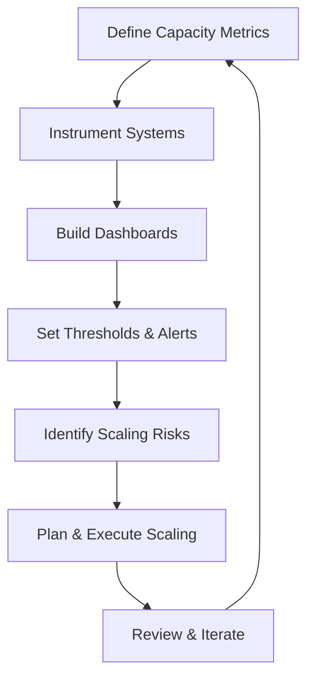
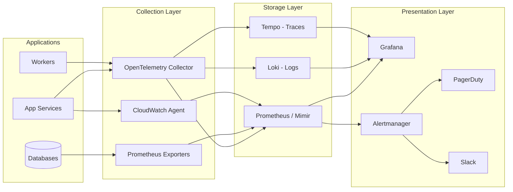

# Capacity Management & Observability — Overview

## Purpose

Establish a systematic approach to capacity management for \<company\>, ensuring the platform can meet current demand, forecast future needs, and surface scaling risks before they become incidents.

## Framework

## Pillars

| Pillar | Document | What It Covers |
|--------|----------|----------------|
| 1. Capacity Metrics | [capacity-metrics.md](capacity-metrics.md) | Which metrics to track across compute, storage, network, and application layers |
| 2. Instrumentation | [instrumentation.md](instrumentation.md) | How to collect metrics: exporters, agents, custom telemetry |
| 3. Dashboards | [dashboards.md](dashboards.md) | Dashboard design, layout, and examples |
| 4. Thresholds | [thresholds.md](thresholds.md) | Setting static and dynamic thresholds, alert routing |
| 5. Scaling Risk Indicators | [scaling-risk.md](scaling-risk.md) | Early-warning signals and risk scoring |

## Observability Stack

## Roles & Responsibilities

| Role | Responsibility |
|------|----------------|
| SRE / Platform Team | Own observability stack, define SLOs, operate alerts |
| Service Owners | Instrument their services, define service-level capacity metrics |
| Engineering Managers | Capacity review participation, scaling budget requests |
| Finance / FP&A | Cloud cost forecasting, budget approval |
