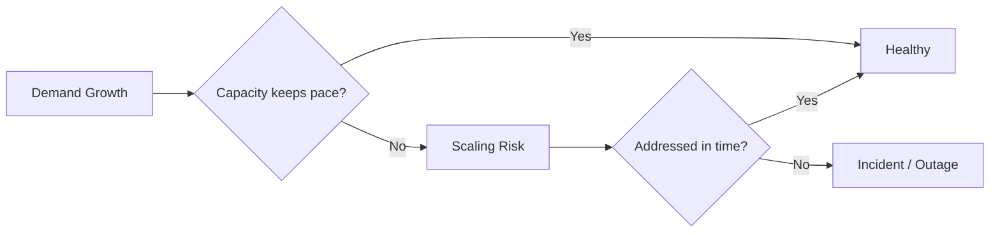
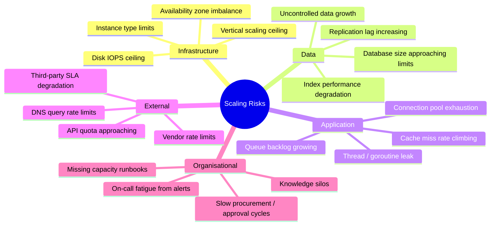
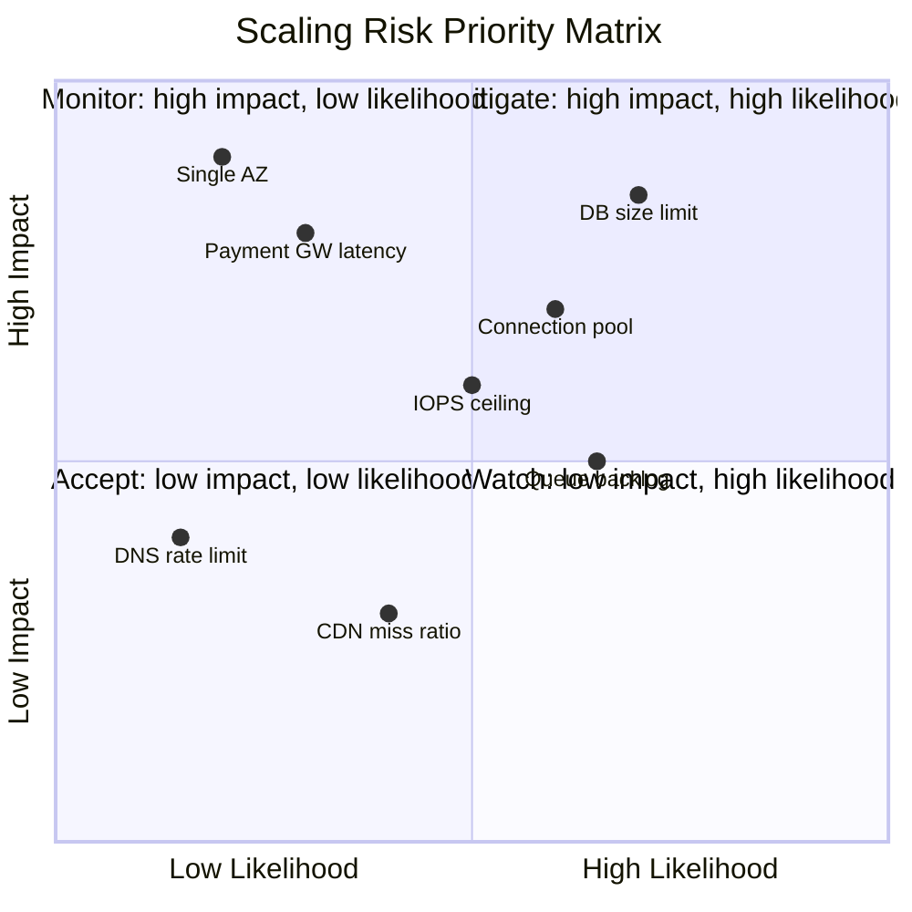
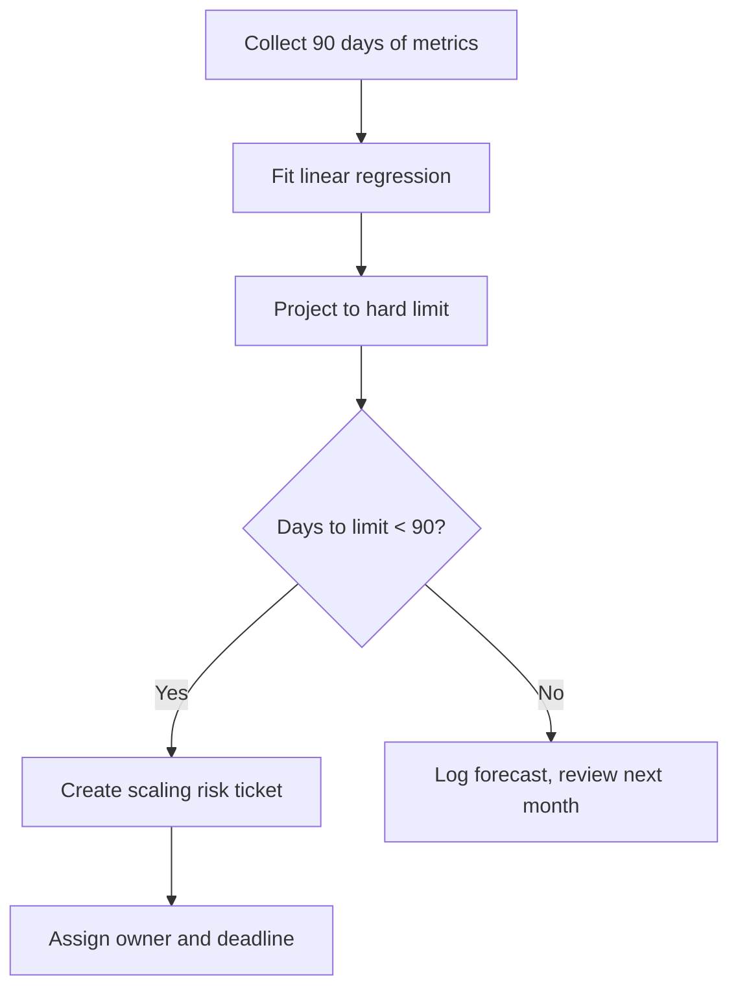

# Identifying Scaling Risk Indicators

## What Is a Scaling Risk?

A scaling risk is any condition where current capacity growth trajectory, architectural constraint, or external dependency will cause degraded performance or an outage **if left unaddressed**.

## Risk Categories

## Scaling Risk Indicators

### Infrastructure Risks

| Indicator | How to Detect | Risk Score Inputs | Lead Time |
|-----------|---------------|-------------------|-----------|
| Largest instance type in use | Inventory check | At ceiling = High | Weeks |
| Single-AZ deployment | Terraform / K8s audit | Single AZ = High | Days |
| Disk IOPS at > 80% provisioned | CloudWatch / Prometheus | Utilisation + trend | Hours |
| Auto-scaler at max replicas > 10% of time | HPA metrics | Frequency + duration | Days |
| Node group at max size | Cluster autoscaler metrics | Time at max / week | Days |

### Data Risks

| Indicator | How to Detect | Risk Score Inputs | Lead Time |
|-----------|---------------|-------------------|-----------|
| PostgreSQL DB > 500 GB | `pg_database_size_bytes` | Size + growth rate | Weeks |
| Replication lag > 1 s sustained | `pg_replication_lag_seconds` | Lag + trend | Hours |
| Table with > 1 billion rows | `pg_stat_user_tables` | Row count + query time | Weeks |
| Index scan → sequential scan regression | `pg_stat_user_tables` seq_scan trend | Ratio change | Days |
| Unpartitioned table > 100 GB | Schema audit | Size + query latency | Weeks |

### Application Risks

| Indicator | How to Detect | Risk Score Inputs | Lead Time |
|-----------|---------------|-------------------|-----------|
| Connection pool > 75% sustained | `db_pool_active / db_pool_max` | Utilisation + trend | Hours |
| Queue depth doubling period < 7 days | `queue_depth` trend | Growth rate | Days |
| Cache hit ratio dropping | `cache_hit_ratio` trend | Ratio + impact on DB | Days |
| p99 latency rising without traffic increase | Latency + RPS correlation | Decoupled trend | Days |
| Error rate correlated with traffic peaks | `errors_total` vs `http_requests_total` | Correlation strength | Hours |

### External / Vendor Risks

| Indicator | How to Detect | Risk Score Inputs | Lead Time |
|-----------|---------------|-------------------|-----------|
| API quota usage > 70% | Vendor dashboard / API | Usage + growth rate | Days |
| Payment gateway latency increasing | Synthetic monitoring | Latency trend | Hours |
| DNS query rate near provider limit | DNS metrics | Rate + headroom | Days |
| CDN cache miss ratio rising | CDN analytics | Ratio + origin load | Days |

## Risk Scoring Model

Each risk is scored on two axes to produce a priority:

### Scoring Rubric

| Score | Likelihood | Impact |
|-------|------------|--------|
| 1 | Unlikely in next 12 months | Minimal user impact |
| 2 | Possible in next 6 months | Degraded experience for subset |
| 3 | Likely in next 3 months | Significant degradation |
| 4 | Expected in next month | Major outage |
| 5 | Imminent (< 2 weeks) | Platform-wide outage |

**Priority = Likelihood × Impact**

| Priority Score | Action |
|----------------|--------|
| 1–6 | Accept / monitor — review quarterly |
| 7–12 | Watch — review monthly, plan mitigation |
| 13–19 | Mitigate — active project, resolve within quarter |
| 20–25 | Urgent — resolve within current sprint |

## Scaling Risk Register

| ID | Risk | Likelihood | Impact | Priority | Owner | Status | Mitigation |
|----|------|------------|--------|----------|-------|--------|------------|
| SR-001 | PostgreSQL primary approaching 500 GB | 4 | 4 | 16 | DBA Team | In Progress | Partition largest tables, archive aged data |
| SR-002 | Redis memory at 78% of max | 3 | 4 | 12 | Platform | Planned | Evaluate cluster scaling, review TTLs |
| SR-003 | Payment gateway single vendor | 2 | 5 | 10 | Payments | Backlog | Integrate secondary gateway |
| SR-004 | HPA at max replicas during peak hours | 3 | 3 | 9 | SRE | Monitoring | Increase max replicas, optimise resource requests |
| SR-005 | Unpartitioned orders table > 80 GB | 3 | 3 | 9 | Backend | Planned | Implement range partitioning by created_at |

## Capacity Forecasting

### Forecast Model (Simplified)

For each key metric:

1. Gather 90 days of daily samples.
2. Apply linear regression: `y = mx + b` where `m` is daily growth.
3. Calculate **days to threshold**: `(threshold - current) / m`.
4. If days to threshold < 90, flag as scaling risk.

For metrics with seasonal patterns, use **Holt-Winters** or **Prophet** for more accurate projections.

## Review Cadence

| Activity | Frequency | Participants |
|----------|-----------|--------------|
| Automated risk scan (CI job) | Daily | Automated |
| Scaling risk standup | Weekly | SRE + service owners |
| Capacity planning review | Monthly | VP Eng + SRE + Finance |
| Full risk register audit | Quarterly | CTO + all leads |
