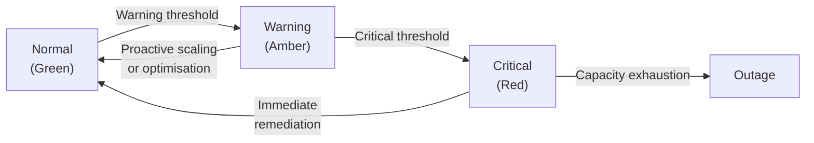
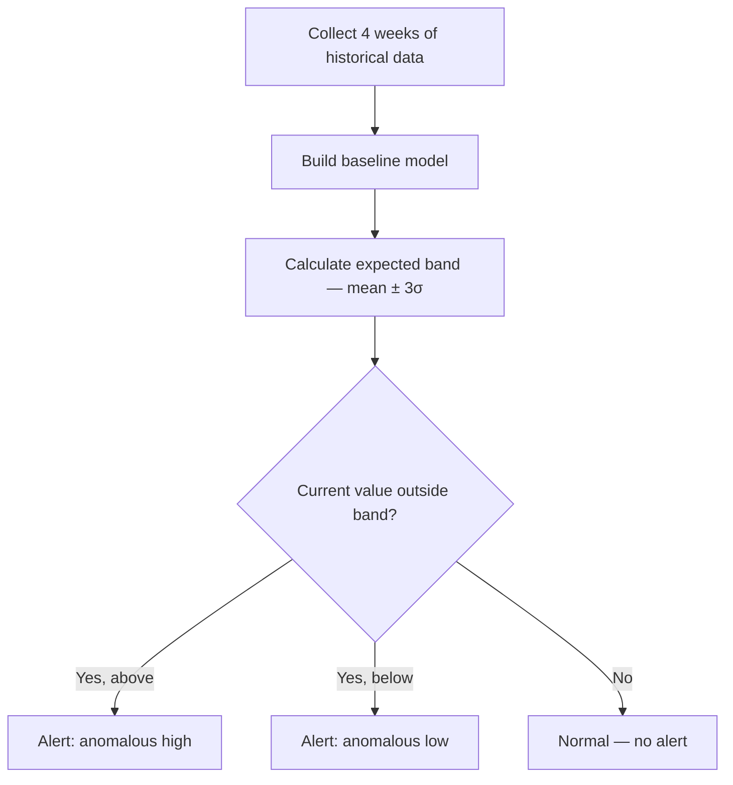
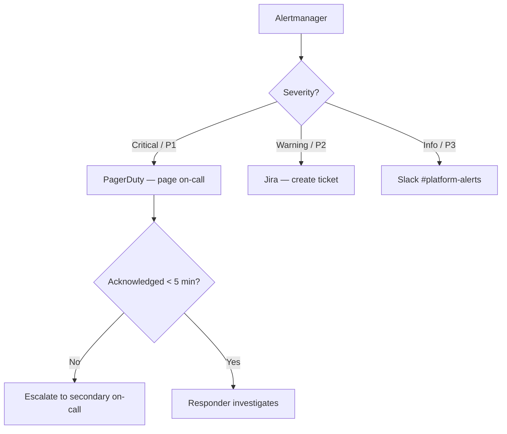

# Defining Thresholds & Alerts

## Threshold Philosophy



- **Warning** — Enough headroom to plan: days to weeks. Triggers a ticket or async notification.
- **Critical** — Imminent risk: minutes to hours. Triggers a page to on-call.

## Threshold Definitions

### Compute

| Metric | Warning | Critical | Evaluation Window | For Duration |
|--------|---------|----------|-------------------|--------------|
| CPU utilisation | > 70% | > 85% | 5 min avg | 15 min |
| Memory utilisation | > 80% | > 90% | 5 min avg | 10 min |
| Container CPU throttle | > 10% | > 25% | 5 min rate | 10 min |
| Container memory vs limit | > 80% | > 90% | instant | 5 min |
| Pending pods | > 0 | > 5 | instant | 5 min |
| OOM kills | > 0 in 1h | > 3 in 1h | 1 h count | instant |

### Storage

| Metric | Warning | Critical | Evaluation Window | For Duration |
|--------|---------|----------|-------------------|--------------|
| Disk used % | > 75% | > 90% | instant | 5 min |
| PostgreSQL DB growth | > 1.5× 30d avg | > 2× 30d avg | daily | 1 day |
| Table bloat ratio | > 30% | > 50% | 6 h check | instant |
| Redis memory vs max | > 75% | > 85% | 1 min avg | 5 min |
| IOPS vs provisioned | > 80% | > 95% | 5 min avg | 10 min |
| S3 daily cost | > 1.3× 7d avg | > 2× 7d avg | daily | 1 day |

### Network

| Metric | Warning | Critical | Evaluation Window | For Duration |
|--------|---------|----------|-------------------|--------------|
| Bandwidth utilisation | > 60% | > 80% | 5 min avg | 10 min |
| Active connections | > 80% of max | > 90% of max | 1 min avg | 5 min |
| TCP retransmit rate | > 1% | > 5% | 5 min rate | 10 min |

### Application

| Metric | Warning | Critical | Evaluation Window | For Duration |
|--------|---------|----------|-------------------|--------------|
| p99 latency vs SLO | > 80% of budget | > 100% of budget | 5 min avg | 10 min |
| Error rate | > 0.5% | > 1% | 5 min rate | 5 min |
| Queue depth | > 50k | > 200k | instant | 5 min |
| DB connection pool | > 75% | > 90% | 1 min avg | 5 min |

## Dynamic Thresholds

For metrics with seasonal patterns (e.g. request rate varies by time of day), use **anomaly detection** instead of static thresholds.



Candidate metrics for dynamic thresholds:
- Request rate (RPS)
- Database query rate
- Queue ingestion rate
- CDN bandwidth

## Alert Routing



### Alertmanager Routing Config (Example)

```yaml
route:
  receiver: slack-info
  group_by: [alertname, service]
  group_wait: 30s
  group_interval: 5m
  repeat_interval: 4h
  routes:
    - match:
        severity: critical
      receiver: pagerduty-critical
      repeat_interval: 5m
    - match:
        severity: warning
      receiver: jira-warning
      repeat_interval: 12h

receivers:
  - name: pagerduty-critical
    pagerduty_configs:
      - routing_key: "<REDACTED>"
        severity: critical
  - name: jira-warning
    webhook_configs:
      - url: "https://jira-webhook.internal/create-ticket"
  - name: slack-info
    slack_configs:
      - channel: "#platform-alerts"
        send_resolved: true
```

## Alert Quality

| Principle | Practice |
|-----------|----------|
| Actionable | Every alert must have a linked runbook |
| Relevant | Suppress known non-issues with inhibition rules |
| Timely | Balance "for" duration — avoid alert storms but don't miss real issues |
| Deduplicated | Group related alerts into a single notification |
| Reviewed | Quarterly alert review: retire stale alerts, tune noisy ones |

## Runbook Template

Each alert links to a runbook following this structure:

```
## Alert: <AlertName>

### Description
What this alert means and why it fires.

### Impact
What users or systems are affected.

### Investigation Steps
1. Check dashboard: <link>
2. Query: <PromQL>
3. Common root causes: ...

### Remediation
- Automated: <script or playbook>
- Manual: Step-by-step instructions

### Escalation
- If unresolved in 30 min, escalate to: <team/person>
```
